# LCP.FE — Local Cinema Player (Frontend)

Web UI for [LCP.BE](https://github.com/anomalyco/LCP.BE). Browse, edit metadata, and stream local video files from the .NET backend.

Angular 21 standalone application with signal-based state, dark/light theming, and a password gate.

## Screenshots

> All screenshots are taken against a synthetic demo library — the titles, studios, thumbnails and clips are generated placeholders, not a real collection.

### Video library

Paginated grid with thumbnails, hover previews, type/collection badges, tags and studios.

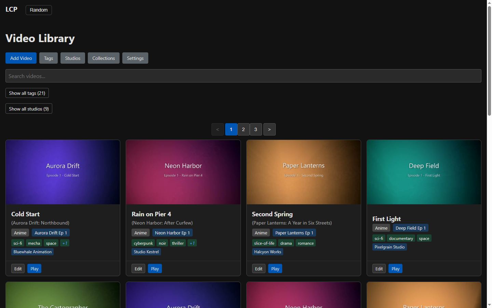

### Filtering

Tags and studios are browsable and clickable; active filters live in the URL query string.

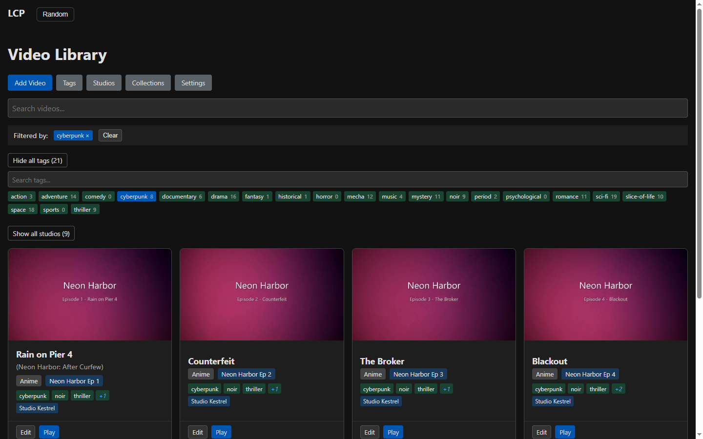

### Player

HTML5 playback with a similar-videos sidebar, a strip of episodes from the same collection, and the 2x anime speed-up badge.

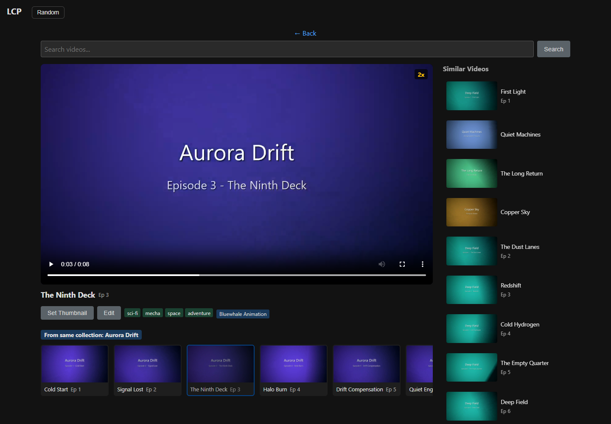

### Metadata editor

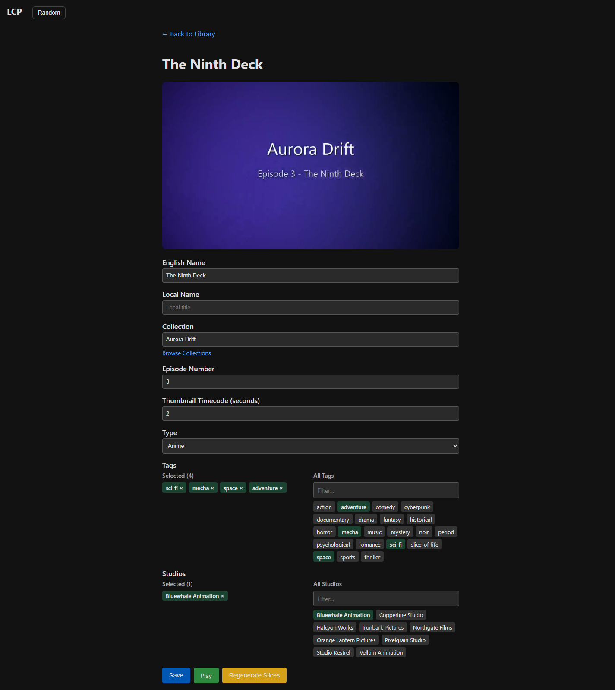

<details>
<summary>More screens</summary>

**Collections** — grouped browsing with a cover thumbnail and video count.

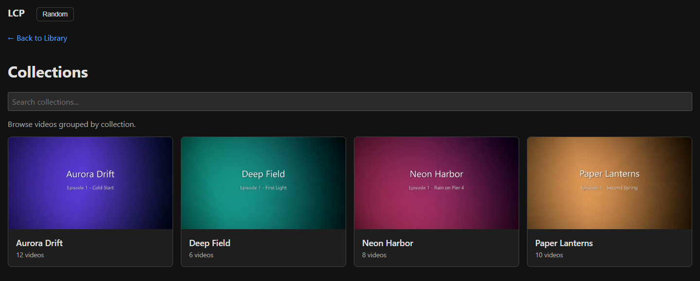

**Videos in a collection**

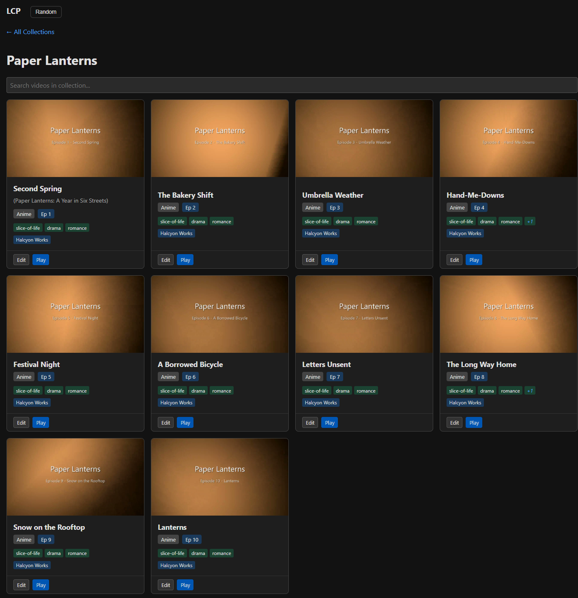

**Tags** — master tag list with usage counts.

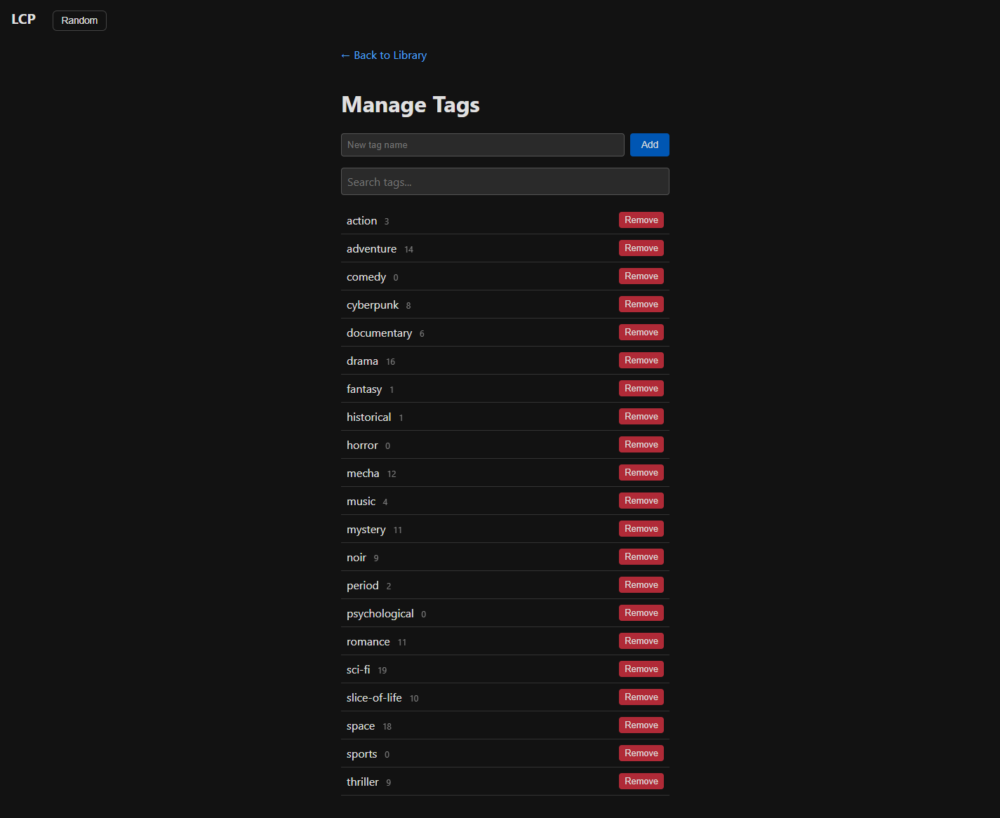

**Studios** — master studio list with usage counts.

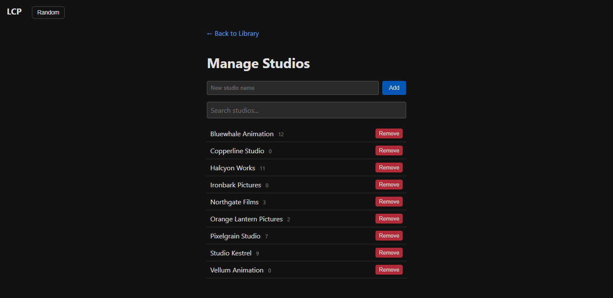

**Settings** — theme, playback and cache options, backup export/import.

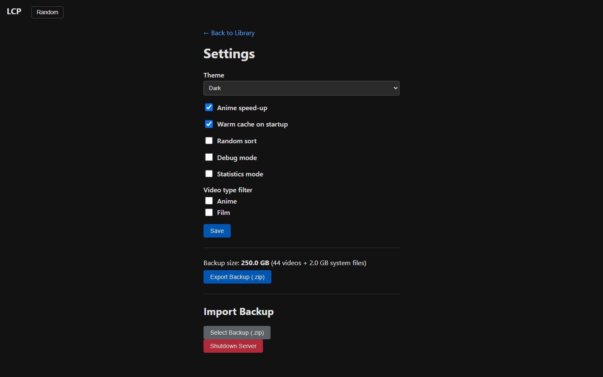

**Add video** — upload a file into the library.

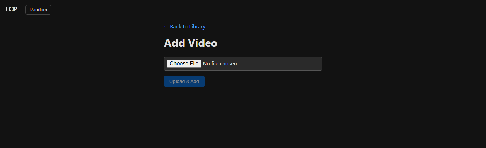

**Password gate** — app-level protection, enforced by the backend.

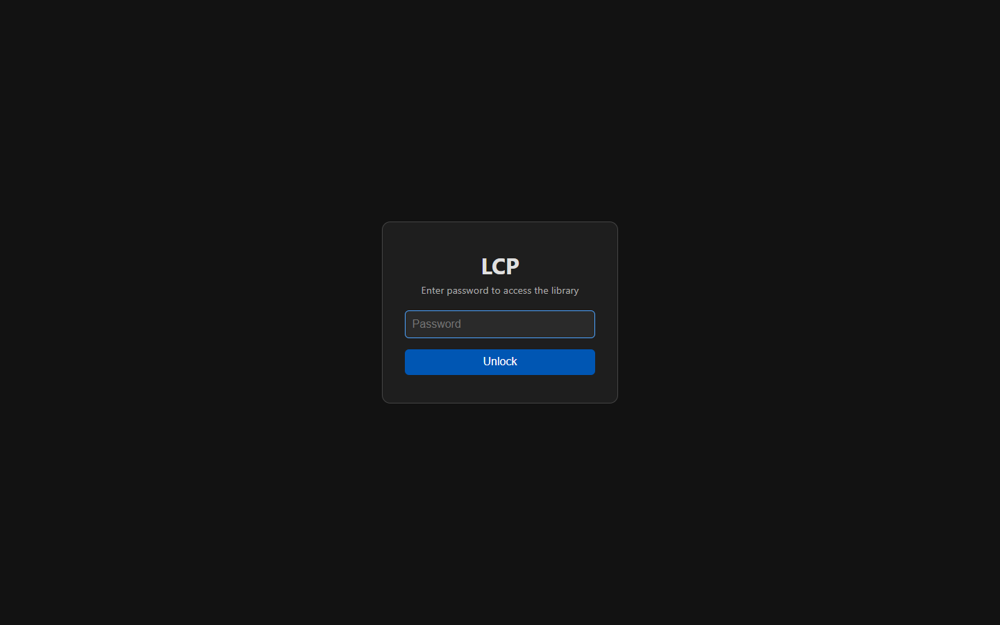

</details>

## Quick Start

```bash
npm install
npm start
```

Open `http://localhost:4200`. Requires LCP.BE running on port 5107 (API calls are proxied through the Angular dev server).

## Routes

| Path | Description |
|---|---|
| `/` | Redirects to `/videos` |
| `/videos` | Paginated video grid (`?page=` preserved in URL) |
| `/videos/:id` | Edit metadata (names, collection, episode, type, tags, studios) |
| `/videos/:id/play` | Stream video with HTML5 `<video>` |
| `/collections` | Browse collections with thumbnails |
| `/collections/:id` | Videos in a collection |
| `/tags` | Manage master tags |
| `/studios` | Manage master studios |
| `/add-video` | Upload a new video file |
| `/settings` | Theme, anime speed-up, warm cache, export/import backup |

## Features

- **Password gate** — app-level protection; the password is never stored client-side, the session lives in an HttpOnly cookie
- **Dark/light theme** — CSS custom properties toggled via `data-theme`
- **Anime speed-up** — automatically plays anime videos at 2x speed (optional)
- **Video preview** — hover over cards to preview video clips
- **Similar videos** — related titles alongside the player, plus the rest of the current collection
- **Tag and studio filters** — filter the grid by any combination, filters are shareable via the URL
- **Back navigation** — preserves your place (page number, collection view) when returning from a video
- **Export/Import backup** — download full library ZIP from settings, restore via file upload

## Build

```bash
npm run build     # production → dist/
npm run watch     # dev rebuild on change
```
